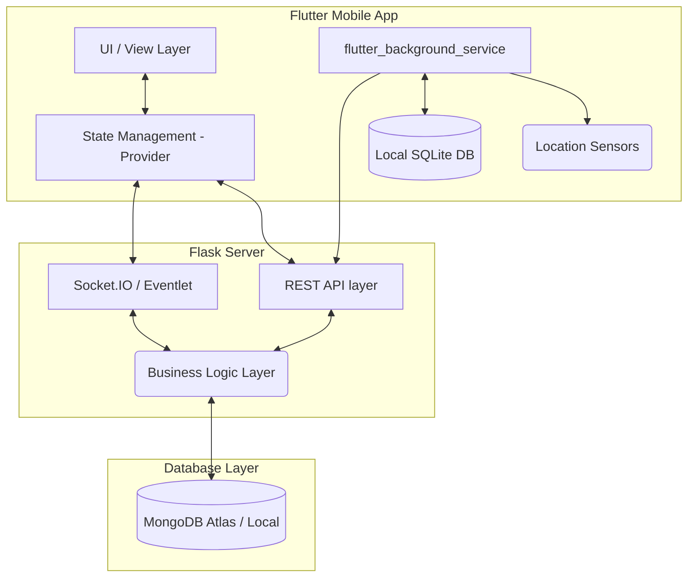
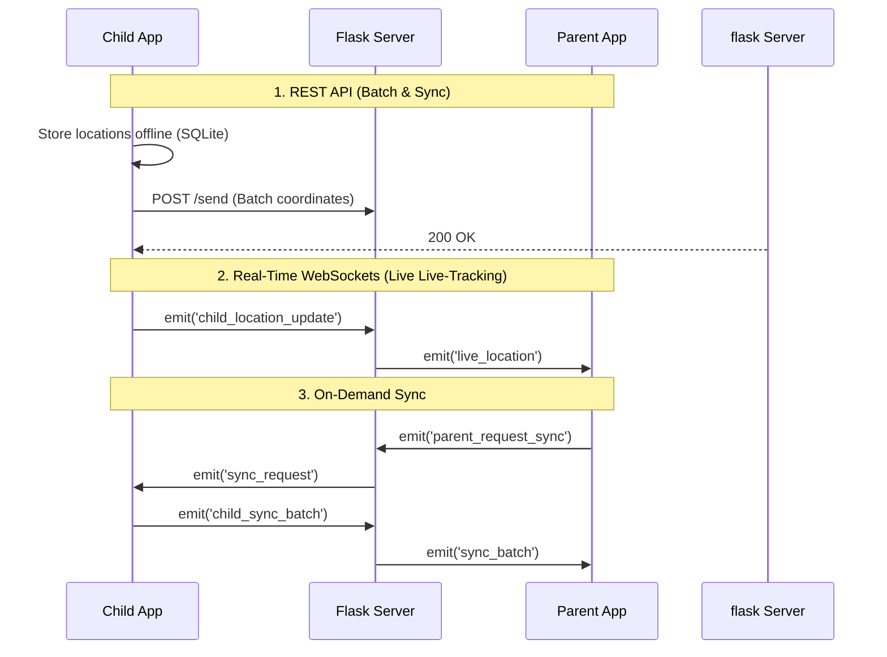

# GPS Tracker

A real-time GPS tracking application with a **Flutter** mobile client and a **Flask + MongoDB** backend server. The app supports child–parent tracking, background location services, trip history, and QR-code-based device pairing.

> **License:** GNU General Public License v3.0 — see [LICENSE](LICENSE).

---

## Table of Contents

- [Architecture Overview](#architecture-overview)
- [Prerequisites](#prerequisites)
  - [Flutter SDK](#1-flutter-sdk)
  - [Android Studio & Android SDK](#2-android-studio--android-sdk)
  - [Python (Backend)](#3-python-backend)
  - [MongoDB](#4-mongodb)
  - [GitHub CLI (Releases)](#5-github-cli-releases)
- [Project Structure](#project-structure)
- [Environment Setup](#environment-setup)
  - [Clone the Repository](#clone-the-repository)
  - [Flutter Setup](#flutter-setup)
  - [Backend Setup](#backend-setup)
  - [Configuration — settings.json](#configuration--settingsjson)
- [Running in Development](#running-in-development)
  - [Start the Backend Server](#start-the-backend-server)
  - [Run the Flutter App](#run-the-flutter-app)
- [Debugging](#debugging)
  - [Flutter Debugging](#flutter-debugging)
  - [Backend Debugging](#backend-debugging)
  - [Database Inspection](#database-inspection)
- [Building for Release](#building-for-release)
- [Creating a Release — ReleaseMaker.py](#creating-a-release--releasemakerpy)
- [API Reference (Quick)](#api-reference-quick)
- [Useful Commands Cheat-Sheet](#useful-commands-cheat-sheet)

---

## Architecture Overview

```
┌──────────────────┐        HTTP / REST        ┌──────────────────────┐
│  Flutter Mobile   │  ◄─────────────────────►  │  Flask Backend       │
│  (Android)        │      /send, /sync, …      │  server.py           │
│                   │                           │  ↕                   │
│  • Firebase Auth  │                           │  MongoDB (Atlas or   │
│  • Background GPS │                           │  local)              │
│  • Offline SQLite │                           └──────────────────────┘
└──────────────────┘
```

| Layer              | Tech                                                                |
| ------------------ | ------------------------------------------------------------------- |
| Mobile client      | Flutter 3.6+, Dart                                                  |
| State management   | Provider                                                            |
| Navigation         | go_router                                                           |
| Maps               | flutter_map + OpenStreetMap                                         |
| Background service | flutter_background_service                                          |
| Backend API        | Flask, Flask-CORS                                                   |
| Database           | MongoDB (via PyMongo)                                               |
| Auth               | bcrypt password hashing (server-side) + Firebase (client-side init) |
| Deployment         | Render (gunicorn via `render.yaml`)                                 |
| Releases           | Git tags + GitHub CLI (`gh`) via `ReleaseMaker.py`                  |

---

## Prerequisites

### 1. Flutter SDK

Install Flutter by following the **official quick-start guide**:

> 🔗 **<https://docs.flutter.dev/get-started/install>**

**Minimum version required:** Flutter SDK that ships with Dart SDK **≥ 3.6.0** (see `pubspec.yaml`).

After installation, verify:

```bash
flutter --version
flutter doctor
```

`flutter doctor` will list any remaining issues (missing Android toolchain, licenses, etc.) — resolve them all before continuing.

### 2. Android Studio & Android SDK

Flutter for Android requires the Android SDK and its build tools. The easiest way to get them is through **Android Studio**:

> 🔗 **<https://developer.android.com/studio>**

After installing Android Studio:

1. Open **SDK Manager** (`Settings → Languages & Frameworks → Android SDK` or `More Actions → SDK Manager` on the welcome screen).
2. Under the **SDK Platforms** tab, install at least **Android 14 (API 34)** or the latest available.
3. Under the **SDK Tools** tab, make sure the following are installed:
   - Android SDK Build-Tools
   - Android SDK Command-line Tools
   - Android SDK Platform-Tools
4. Accept all SDK licenses:
   ```bash
   flutter doctor --android-licenses
   ```

> **Tip:** You don't need to use Android Studio as your editor — VS Code with the Flutter extension works great. Android Studio is only needed for the SDK and emulator.

#### Setting Up an Emulator (Optional)

For on-screen testing without a physical device:

1. In Android Studio → **Device Manager** → **Create Virtual Device**.
2. Pick a device profile (e.g. Pixel 7) and a system image (API 34+).
3. Boot the emulator, then `flutter run` will auto-detect it.

#### Using a Physical Device

1. Enable **Developer Options** & **USB Debugging** on your Android phone.
2. Connect via USB and authorize the computer.
3. Verify: `flutter devices` should list it.

### 3. Python (Backend)

The backend server requires **Python 3.8+**.

```bash
python3 --version   # Should be 3.8 or higher
pip3 --version
```

### 4. MongoDB

The backend connects to MongoDB. You need **one** of:

- **Local MongoDB** — Install [MongoDB Community Edition](https://www.mongodb.com/docs/manual/installation/) and start `mongod`.

  ```bash
  # Ubuntu/Debian example
  sudo systemctl start mongod
  ```

  Default URI: `mongodb://localhost:27017/`

- **MongoDB Atlas (Cloud)** — Create a free cluster at [mongodb.com/atlas](https://www.mongodb.com/atlas) and get your connection string.

### 5. GitHub CLI (Releases)

The release script (`ReleaseMaker.py`) uses `gh` to create GitHub releases.

```bash
# Install
# Ubuntu/Debian
sudo apt install gh

# macOS
brew install gh

# Then authenticate
gh auth login
```

> 🔗 <https://cli.github.com/>

---

## Project Structure

```
GPSTrackerBackend/
├── lib/                        # Flutter app source
│   ├── main.dart               # App entry point (Firebase init, background service)
│   ├── nav.dart                # go_router navigation
│   ├── theme.dart              # Light & dark theme definitions
│   ├── data/                   # Data models & local DB
│   ├── pages/                  # UI pages (auth, dashboard, map, profile, trips)
│   ├── services/               # auth_service, background_service, location_service
│   ├── state/                  # App session / state management
│   ├── ui/                     # Shared UI components
│   └── utils/                  # Utility helpers
├── android/                    # Android native config (Gradle, manifests)
├── server.py                   # Flask backend server
├── wsgi.py                     # WSGI entry point (for gunicorn / production)
├── requirements.txt            # Python dependencies
├── settings.json               # Local config (gitignored — see below)
├── pubspec.yaml                # Flutter dependencies
├── analysis_options.yaml       # Dart linter config
├── render.yaml                 # Render.com deployment descriptor
├── ReleaseMaker.py             # Release automation script
├── print_db.py                 # DB inspection utility
├── test_server.py              # Backend test script
├── plan.md                     # UI/UX design plan
└── LICENSE                     # GPLv3
```

---

## Environment Setup

### Clone the Repository

```bash
git clone https://github.com/<your-org>/GPSTrackerBackend.git
cd GPSTrackerBackend
```

### Flutter Setup

```bash
# 1. Fetch Flutter dependencies
flutter pub get

# 2. Verify everything is ready
flutter doctor
```

> **Firebase:** The app initializes Firebase in `main.dart`. For Android, make sure you have a valid `android/app/google-services.json` file. If you don't have one, create a Firebase project at [console.firebase.google.com](https://console.firebase.google.com/), register your Android app (`com.example.gpstracking`), and download the config file.

### Backend Setup

```bash
# 1. Create a virtual environment (recommended)
python3 -m venv venv
source venv/bin/activate   # Linux/macOS
# venv\Scripts\activate    # Windows

# 2. Install Python dependencies
pip install -r requirements.txt
```

### Configuration — `settings.json`

This file is **gitignored** (it contains credentials). Create it manually in the project root:

```json
{
  "backend_url": "http://localhost:5000",
  "mongo_uri": "mongodb://localhost:27017/",
  "db_name": "GPSTracker",
  "debug_mode": true
}
```

| Key           | Description                                |
| ------------- | ------------------------------------------ |
| `backend_url` | Base URL the Flutter app talks to          |
| `mongo_uri`   | MongoDB connection string (local or Atlas) |
| `db_name`     | Database name inside MongoDB               |
| `debug_mode`  | `true` for verbose logging                 |

> **For MongoDB Atlas**, replace `mongo_uri` with your Atlas connection string:
>
> ```
> mongodb+srv://<user>:<password>@<cluster>.mongodb.net/?appName=<name>
> ```

---

## Running in Development

### Start the Backend Server

```bash
# Make sure your venv is activated and MongoDB is running
python server.py
```

The API server starts on **`http://0.0.0.0:5000`**. You should see:

```
 * Running on http://0.0.0.0:5000
```

Verify it's alive:

```bash
curl http://localhost:5000/serverstatus
# → {"server": true}
```

### Run the Flutter App

With an emulator running or a physical device connected:

```bash
# Debug mode (hot reload enabled)
flutter run

# Or target a specific device
flutter devices          # list available devices
flutter run -d <device>  # run on a specific one
```

> **Important:** Make sure the Flutter app's backend URL in `settings.json` points to your machine's IP (not `localhost`) if testing on a physical device, since `localhost` on the phone refers to the phone itself.

---

## Debugging

### Flutter Debugging

| Tool                | How                                                                             |
| ------------------- | ------------------------------------------------------------------------------- |
| **Hot Reload**      | Press `r` in the terminal while `flutter run` is active                         |
| **Hot Restart**     | Press `R` (full state reset)                                                    |
| **DevTools**        | Press `d` or run `flutter run` and open the DevTools URL printed in the console |
| **Dart Analyzer**   | `flutter analyze` — runs the linter from `analysis_options.yaml`                |
| **Verbose logging** | `flutter run -v`                                                                |
| **VS Code**         | Install the **Flutter** and **Dart** extensions, set breakpoints, press F5      |
| **Android Studio**  | Open the project, use the built-in debugger and layout inspector                |

#### Common Issues

| Problem               | Fix                                                                                               |
| --------------------- | ------------------------------------------------------------------------------------------------- |
| `Gradle build failed` | Run `cd android && ./gradlew clean && cd ..` then `flutter run` again                             |
| Firebase init fails   | Ensure `android/app/google-services.json` exists and matches your Firebase project                |
| `minSdkVersion` error | The app uses `flutter.minSdkVersion` — update it in `android/app/build.gradle.kts` if needed      |
| Device not found      | Run `flutter devices`, check USB debugging, or restart ADB: `adb kill-server && adb start-server` |

### Backend Debugging

```bash
# Run with Flask's built-in debugger (auto-reload on file changes)
FLASK_DEBUG=1 python server.py
```

- Set `"debug_mode": true` in `settings.json` for verbose server logs.
- Use tools like **Postman**, **Insomnia**, or **curl** to test API endpoints.

### Database Inspection

A helper script `print_db.py` is included for quick database inspection:

```bash
python print_db.py
```

You can also connect directly with the `mongosh` shell:

```bash
mongosh "mongodb://localhost:27017/GPSTracker"

# List today's location data
db.getCollection("2026_03_08").find().pretty()

# List all users
db.ourusers.find().pretty()
```

---

## Building for Release

### Build a Release APK

```bash
flutter build apk --release
```

The output APK will be at:

```
./build/app/outputs/apk/release/app-release.apk
```

### Build a Debug APK

```bash
flutter build apk --debug
```

Output:

```
./build/app/outputs/apk/debug/app-debug.apk
```

### Build an App Bundle (for Play Store)

```bash
flutter build appbundle --release
```

Output:

```
./build/app/outputs/bundle/release/app-release.aab
```

> **Note:** The release build currently uses debug signing keys (see `android/app/build.gradle.kts`). For production Play Store releases, configure your own signing key — see [Flutter deployment docs](https://docs.flutter.dev/deployment/android).

---

## Creating a Release — `ReleaseMaker.py`

The `ReleaseMaker.py` script automates the full release workflow: version bumping, git tagging, pushing, and creating a GitHub release with the APK attached.

### Prerequisites

- Git repository with push access
- [GitHub CLI (`gh`)](https://cli.github.com/) installed and authenticated
- A built APK (release or debug)

### Usage

```bash
python ReleaseMaker.py
```

The script will prompt you interactively:

```
Release type (stable/canary):    # "stable" or "canary"
Work type (patch/minor/major):   # semver bump type
Write release notes:             # freeform release notes
APK path [...]:                  # "release", "debug", or a custom path
```

### What It Does (Step by Step)

1. **Reads the latest git tag** — e.g. `v1.2.3`
2. **Bumps the version** based on your chosen work type:
   - `patch` → `v1.2.4`
   - `minor` → `v1.3.0`
   - `major` → `v2.0.0`
3. **Appends `-canary`** if the release type is canary (e.g. `v1.3.0-canary`)
4. **Creates an annotated git tag** with the release notes
5. **Pushes the tag** to origin
6. **Creates a GitHub release** via `gh release create` with the APK attached

### Example: Full Release Flow

```bash
# 1. Make sure your code is committed and pushed
git add -A
git commit -m "feat: add trip history page"
git push origin main

# 2. Build the release APK
flutter build apk --release

# 3. Run the release maker
python ReleaseMaker.py
# → Release type: stable
# → Work type: minor
# → Release notes: Added trip history page with date filtering
# → APK path: release    (uses the default release APK path)
#
# Output:
# Creating release: v1.3.0
# Release created: v1.3.0
```

### Versioning Scheme

| Type     | When to Use                        | Example             |
| -------- | ---------------------------------- | ------------------- |
| `patch`  | Bug fixes, small tweaks            | `v1.2.3` → `v1.2.4` |
| `minor`  | New features, non-breaking changes | `v1.2.3` → `v1.3.0` |
| `major`  | Breaking changes, large rewrites   | `v1.2.3` → `v2.0.0` |
| `canary` | Pre-release / testing builds       | `v1.3.0-canary`     |

---

## API Reference (Quick)

All endpoints are served by `server.py` on port **5000**.

### Auth

| Method | Endpoint                 | Description                              |
| ------ | ------------------------ | ---------------------------------------- |
| `POST` | `/auth/register`         | Register (email, password, display_name) |
| `POST` | `/auth/login`            | Login (email, password) → user object    |
| `GET`  | `/auth/profile?user_id=` | Get user profile                         |
| `PUT`  | `/auth/profile`          | Update profile (display_name, role)      |

### GPS Tracking

| Method | Endpoint                      | Description                         |
| ------ | ----------------------------- | ----------------------------------- |
| `POST` | `/send`                       | Send batch of GPS coordinates       |
| `POST` | `/sync`                       | Sync from a given timestamp         |
| `GET`  | `/sync_all?userid=`           | Get all historical data for a user  |
| `GET`  | `/viewtoday?userid=`          | Get today's coordinates             |
| `GET`  | `/history?userid=`            | List dates with recorded data       |
| `GET`  | `/history/view?userid=&date=` | Get coordinates for a specific date |
| `GET`  | `/serverstatus`               | Health check → `{"server": true}`   |

---

## Useful Commands Cheat-Sheet

```bash
# ─── Flutter ──────────────────────────────────────
flutter pub get                 # Install dependencies
flutter run                     # Run in debug mode
flutter run --release           # Run in release mode
flutter build apk --release     # Build release APK
flutter build apk --debug       # Build debug APK
flutter analyze                 # Run Dart linter
flutter clean                   # Clean build artifacts
flutter doctor                  # Check environment health

# ─── Backend ──────────────────────────────────────
source venv/bin/activate        # Activate Python venv
pip install -r requirements.txt # Install Python deps
python server.py                # Run dev server (port 5000)
FLASK_DEBUG=1 python server.py  # Run with auto-reload
python print_db.py              # Inspect database
python test_server.py           # Run backend tests

# ─── Release ──────────────────────────────────────
python ReleaseMaker.py          # Interactive release workflow

# ─── Git ──────────────────────────────────────────
git tag                         # List all tags
git describe --tags --abbrev=0  # Show latest tag
gh release list                 # List GitHub releases
```

---

## Contributing

1. Fork the repository
2. Create a feature branch: `git checkout -b feat/your-feature`
3. Commit your changes: `git commit -m "feat: describe your change"`
4. Push to your fork: `git push origin feat/your-feature`
5. Open a Pull Request

Please follow [Conventional Commits](https://www.conventionalcommits.org/) for commit messages.

---

<p align="center">
  <strong>GPS Tracker</strong> — Built with Flutter & Flask<br>
  Licensed under <a href="LICENSE">GPLv3</a>
</p>

---

---

# Offline Location Tracker Architecture

## 1. High-Level Architecture

The system follows a client-server architecture, specifically designed to handle background location updates, offline data persistence, and real-time parent-child device synchronization.



> [!NOTE]
> The dual architecture of the client allows it to act as both a **Child** (transmitting location) and a **Parent** (monitoring location), relying heavily on background processing and robust real-time communication.

---

## 2. Frontend Architecture (Flutter)

The frontend is a cross-platform Android application built using **Flutter**.

### Core Layers

- **UI & View:** Built using standard Flutter widgets and mapping engines (`flutter_map` + OpenStreetMap).
- **Routing:** Handled via `go_router` for a predictable and deep-linkable navigation state.
- **State Management:** Driven by `Provider`, which acts as the source of truth for the session, connecting the UI to the background streams.
- **Background Execution Workflows:** Using `flutter_background_service` hooked with `geolocator`. It wakes up the device sensors regardless of whether the app is in the foreground, background, or swiped away.
- **Offline Fallback:** If internet connectivity drops, location telemetry is safely deferred to an **on-device SQLite** store.

---

## 3. Backend Architecture (Flask)

The backend is a lightweight yet highly concurrent Python application.

### Core Stack

- **Framework:** **Flask** provides the routing and request context.
- **Concurrency limits:** Backed by `Eventlet` acting as the asynchronous WSGI server to gracefully handle long-lived WebSocket connections without blocking the main event loops.
- **Deployment:** Configured for out-of-the-box deployment to cloud platforms like Render (via `render.yaml` & `gunicorn`).

### Primary Responsibilities

1.  **Authentication Control:** Cryptographic hashing of passwords leveraging `bcrypt`.
2.  **Telemetry Offloading:** Endpoints to rapidly collect batched or individual GPS coordinates.
3.  **Real-Time Subscriptions:** Managing the pairing and real-time forwarding of state between parent and child devices.

---

## 4. Communication & Transactions

The system uses a **Bimodal Communication Protocol** to optimize for battery life, reliability, and low latency.



### 4.1 REST API (Stateless)

Used for standard requests that tolerate regular HTTP overhead and don't require streaming.

- **Transactions:** `POST /auth/login`, `POST /send` (Batch Data Dump), `GET /history`.
- **Characteristics:** Secure, easy to load-balance, traditional Request/Response paradigm.

### 4.2 WebSockets / Socket.IO (Stateful)

Used exclusively for live interactions where polling via HTTP would dramatically drain the battery and increase latency.

- **Transactions:** `child_online` presence detection, `child_location_update` real-time pipelining, and peer-to-peer style on-demand sync flows.
- **Characteristics:** Dedicated TCP connection, event-driven, bidirectional.

---

## 5. Database (DB)

### MongoDB (Primary Remote DB)

Used as the persistent data lake for the application. It stores everything from user credentials to historical GPS data.

- **Collections Structure:**
  - `ourusers`: Stores authentication properties and roles.
  - **Dynamic Sharding by Date:** Collections are named dynamically per date (e.g., `2026_03_08`). This essentially acts as time-series data sharding, heavily limiting the size of indexes and speeding up daily retrieval.

### SQLite (Secondary Local DB)

Used strictly on the client (Flutter) device.

- **Purpose:** Ensures **zero data loss** when moving through dead zones.
- **Mechanism:** Background services write to it constantly. A background job polls this SQLite DB and attempts `POST` syncs to the Backend. Upon HTTP 200 success, the synced rows are seamlessly purged from the local table.

---
